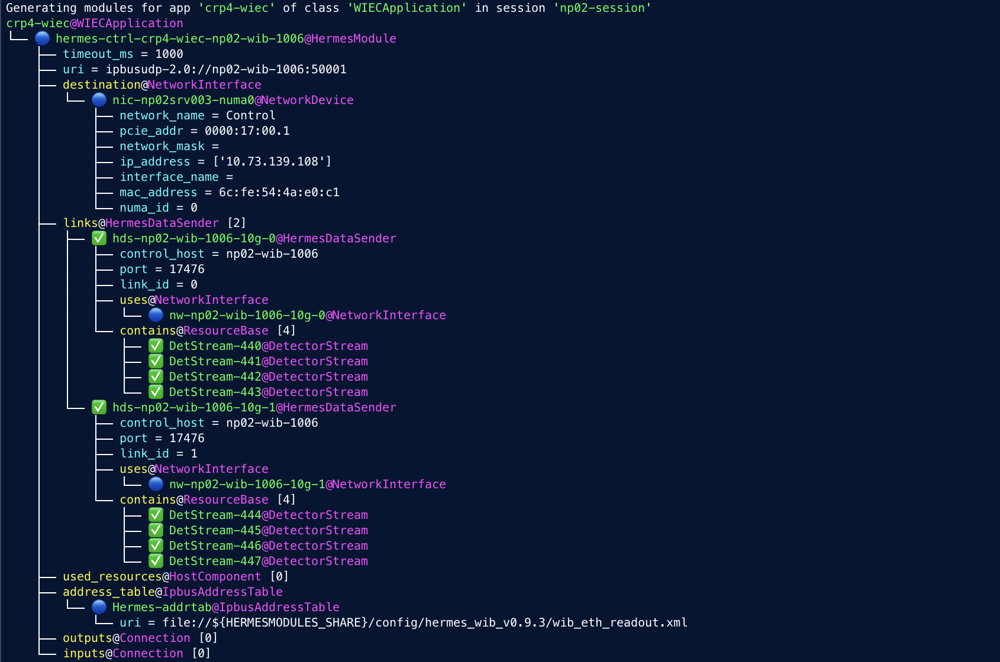

# DAQ Configuration Inspector

:warning: `daqconf_inspector` is in active development and is likely to evolve significantly the near future.

`daqconf_inspector` is a commandline utility created to explore new ways to visualize and verify DAQ configurations and the objects they contain.
`daqconf_inspector` provides a set of commands to probe different aspects of a configuration database. The commands are accessible using with the usual syntax 

```
daqconf_inspector [OPTIONS] CONFIG_FILE COMMAND [ARGS]...
```

where `CONFIG_FILE` is the path to the configuration database being inspected.
Detailed help is available for each command (including `daqconf_inspector` via the `-h/--help` flags).

### Usage
```
daqconf_inspector [OPTIONS] CONFIG_FILE COMMAND [ARGS]...

Options:
  -i, --interactive  Start an interactive IPython session after executing the
                     commands
  -h, --help         Show this message and exit.

Commands:
  list-classes           List known classes and objects for each class
  show-object-tree       Show relationship tree
  show-objects-of-class  Show properties of objects belonging to a class
  show-sessions          Show sessions information
  show-smartapp-mods     Shows the modules generated by a smart application
  verify-detstreams      Verify detector streams in the database
  verify-smart-apps      Verify smart applications in database
  ```

## Inspection
### `list-classes`

Displays the list of classes known to the schema loaded fom the database, together with the
ids of objects belonging to that class fond in the database.

```
Usage: daqconf_inspector CONFIG_FILE list-classes [OPTIONS]

Options:
  -d, --show-derived-objects-as-parents
                                  Include derived objects in parent class
                                  listing
  -h, --help                      Show this message and exit.
```
**Example**

`daqconf_inspector ./ehn1-daqconfigs/sessions/np02-session.data.xml list-classes`


### `show-object-tree`
### `show-objects-of-class`
### `show-sessions`


### `show-smartapp-mods`

Executes the generate modules method for the selected smart application and session, and displays the results as a hierarchical tree.
Resource objects are displaied with their status.

In case visualising a single relationship branch is desired, the focus path option (see below for details) allows to specify the branch to focus on, starting trom the top object.
If a focus path is specified, the recursion level is applied starting from the last element of the focus path.
The focus path syntax combines relationhsip and object names, using `.` separators, and `[]` to select a single item in multi-value relatiosnips.
The structure of the focus path specifier is `<relationship>[<optional object name>].<relationship>[<optional object name>]`.
Note: specifiying the object name is required .


**Legend**
  
| Icon  | Meaning|
|---|---|
| ✅ | Resource enabled |
| ❌ | Resource directly disabled (included in the Session disable list) |
| ⭕️ | Resource indirectly disabled by algorithm |
| 🔵 | Not a resource |

**Example**

`daqconf_inspector ehn1-daqconfigs/sessions/np02-session.data.xml show-smartapp-mods np02-session crp4-wiec -f hermes-ctrl-crp4-wiec-np02-wib-1006 -l 2`




## Verification
### `verify-detstreams`

Performs basic validation of detector datastreams in a database.

It checks the collection of all detastreans in the database for uiniqueness.
It also checks that all geo_ids references by detecor streams are unique.

### `verify-smart-apps`

Performs basic validation on smart daq applications a database.

Implemented tests:

- *services*: The exposed service consistency between application interface and network rules is checked.
  the services referenced in network rules are compared with the list in the `exposes_service` attribute.
  The tedt fails if any of the network rules services is not present in `exposes_service`.